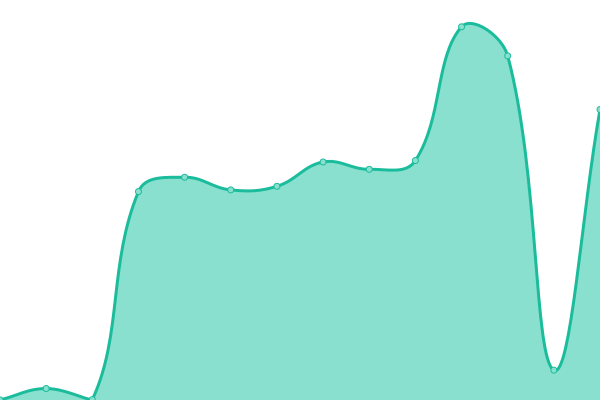

# [📈 Live Status](https://AVA-3568.github.io/webupptime): <!--live status--> **🅾️ 部分停机**

This repository contains the open-source uptime monitor and status page for [AVA-3568](https://AVA-3568.github.io/webupptime), powered by [Upptime](https://github.com/upptime/upptime).

With [Upptime](https://upptime.js.org), you can get your own unlimited and free uptime monitor and status page, powered entirely by a GitHub repository. We use [Issues](https://github.com/AVA-3568/webupptime/issues) as incident reports, [Actions](https://github.com/AVA-3568/webupptime/actions) as uptime monitors, and [Pages](https://AVA-3568.github.io/webupptime) for the status page.

<!--start: status pages-->
<!-- This summary is generated by Upptime (https://github.com/upptime/upptime) -->
<!-- Do not edit this manually, your changes will be overwritten -->
<!-- prettier-ignore -->
| 链接 | 状态 | 历史 | 响应时间 | 正常运行时间 |
| --- | ------ | ------- | ------------- | ------ |
|  nz | 🆗正常运行 | [nz.yml](https://github.com/AVA-2568/webupptime/commits/HEAD/history/nz.yml) | 

 319毫秒
     
 | 

<a href="https://AVA-2568.github.io/webupptime/history/nz">100.00%</a>
    

|  POST webhost | 🆗正常运行 | [post-webhost.yml](https://github.com/AVA-2568/webupptime/commits/HEAD/history/post-webhost.yml) | 

 4211毫秒
     
 | 

<a href="https://AVA-2568.github.io/webupptime/history/post-webhost">16.71%</a>
    

|  webhost1 | 🅾️停机 | [webhost1.yml](https://github.com/AVA-2568/webupptime/commits/HEAD/history/webhost1.yml) | 

 4927毫秒
     
 | 

<a href="https://AVA-2568.github.io/webupptime/history/webhost1">0.00%</a>
    

<!--end: status pages-->

[**Visit our status website →**](https://AVA-3568.github.io/webupptime)

## 📄 License

- Powered by: [Upptime](https://github.com/upptime/upptime)
- Code: [MIT](./LICENSE) © [Anand Chowdhary](https://anandchowdhary.com), supported by [Pabio](https://pabio.com)
- Data in the `./history` directory: [Open Database License](https://opendatacommons.org/licenses/odbl/1-0/)
